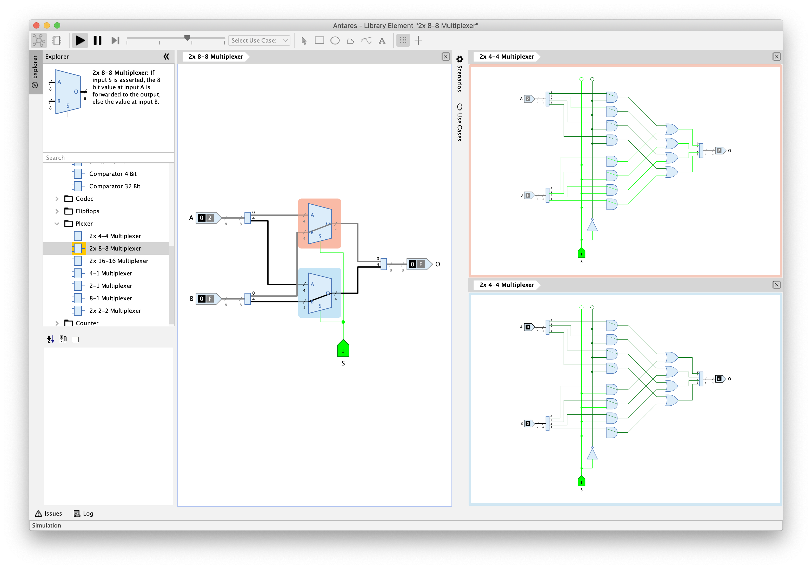

# Antares

Antares is a learning platform for digital circuits. In addition to drawing and simulating digital circuits, Antares places particular emphasis on providing tools to help students better understand how these circuits work.

See the [project page](https://flandreas.github.io/antares/) for documentation and application installers.

If you find any bugs or are missing a feature, you are very welcome to open an issue in the issue tracker of this GitHub project.
